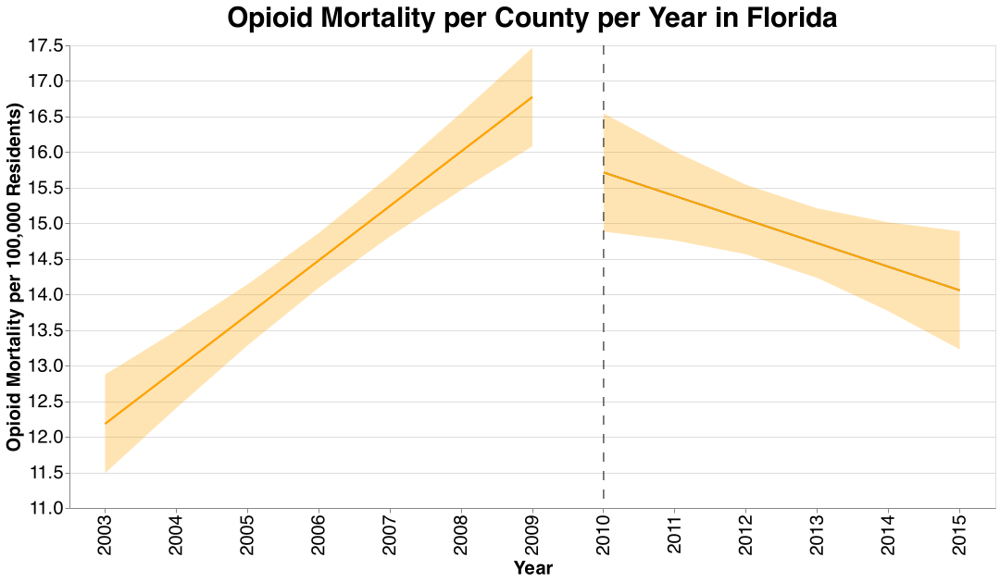
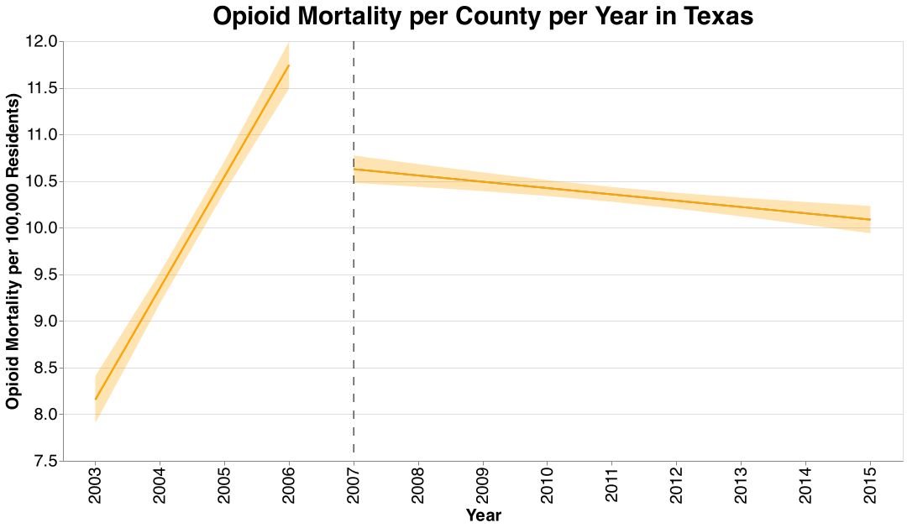
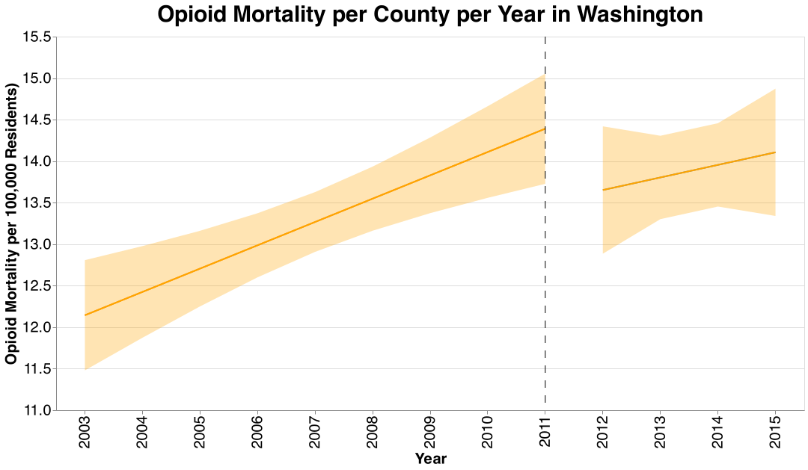
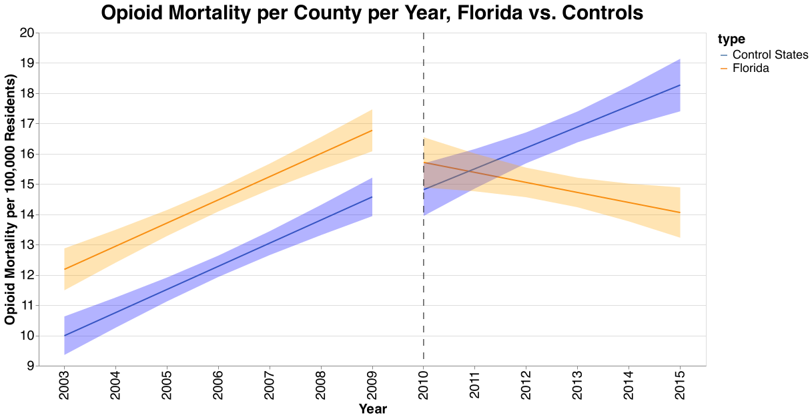
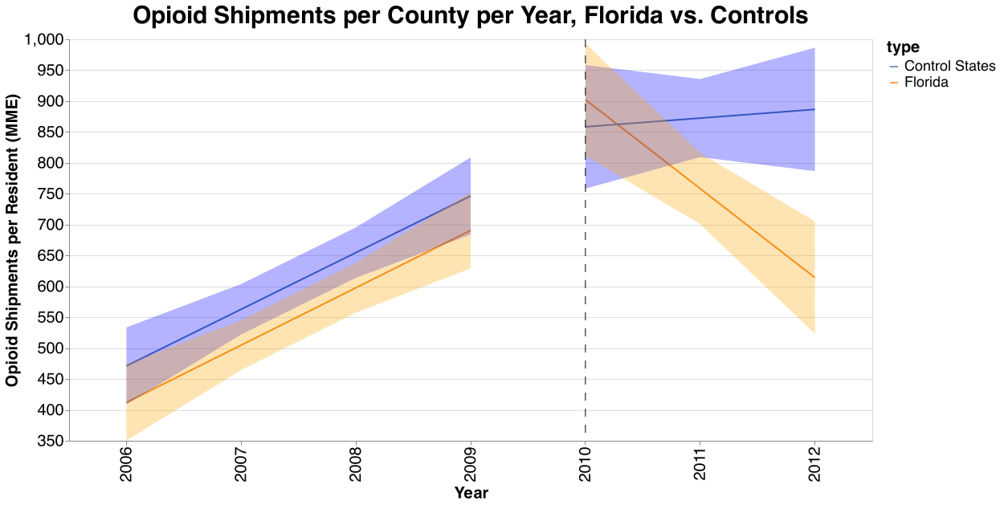
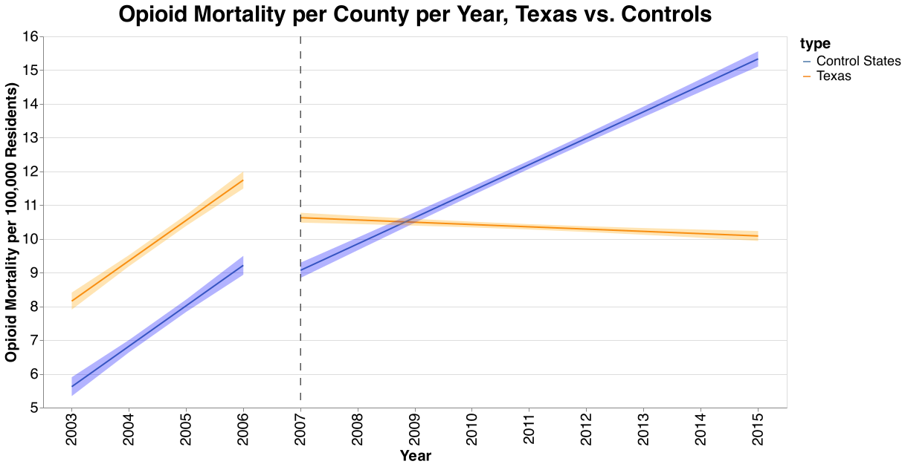
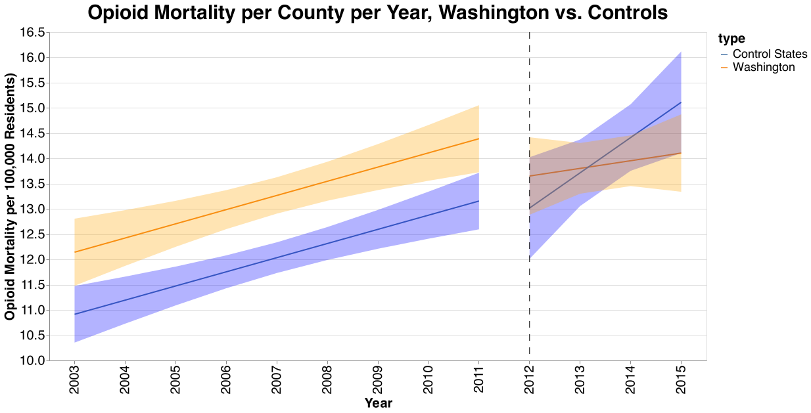

## Analysis Interpretation

### Pre-Post Analysis

For this analysis, we simply observed at the trend in either opioid prescription shipments or opioid overdoses in states with a policy change, in the years before and after that policy change. Therefore, four relevant graphs were generated: opioid shipments in Florida, and opioid overdoses in Florida, Texas, and Washington, individually. These graphs visually demonstrate whether or not there was a change in the trend of opioid shipments or mortality per year before and after the state's policy change. First off, included are both opioid shipments per capita and mortality per capita before and after the significant policy change in 2010.

Interestingly, we can see that there is a clear increasing trend in both opioid shipments and opioid mortality prior to 2010, after which this trend is reversed. However, the reversal in trend is not as clear in the mortality data—there is greater uncertainty. Overall, from these graphs, we can assert relatively confidently that there was a change in the trend of opioid shipments per capita in Florida after the policy change, and mortality also appears to display a different trend, but we are less confident, due to the larger error bands.

Next, displayed are opioid mortality trends in Texas and Washington, again, before and after policy changes.

Visibly, the results here are not as clear. In Texas, there is a step increasing trend in mortality before the policy change (2007), and a much flatter trend subsequently. While the evidence is not clear enough to say there is a reversal in the trend, the increase is at least dampened. In Washington, on the other hand, there is visibly very limited evidence that the trend in opioid mortality was altered at all after the policy change. While the confidence band is wide, the trend itself is nearly identical.

### Difference-in-Difference Analysis

While the trends above are an important part of the story, the pre-post analysis does not take into account any other confounders that could be happening at a national level, also influencing either opioid shipments or mortality. For example, it's possible that the difference in trend witnessed Florida, could be happening nationally, in which case it would be inappropriate to conclude that the observed difference was caused by Florida's specific policy change. To account for this possibility, we also conducted a difference-in-difference analysis, in which we visualize the same pre-post analysis for the policy change state, but also include a selection of control counties. As previously, there are the same four graphs, but in this case, the graphs also include the selected control counties before and after the policy change. Below are graphs for Florida, for both mortality and shipment data. The pre-post lines representing Florida are exactly the same as above, but these graphs also contain the selected control counties. It is evident that the general generally continues in the control counties, directly supporting the previous conclusion from the pre-post analysis.

Similarly, below are the graphs for mortality in Texas and Washington. For Texas, the change in the increasing trend previous to the policy change is much more visible when compared with the control. In Washington's graph, interestingly, it is evident that in the control states, the increase in opioid mortality is generally larger after 2011. This suggests that while Washington's policy change may have not directly altered the trend, it may have limited an even more dramatic increase in mortality observed in counties with similar trends before the policy trend.

## Conclusion